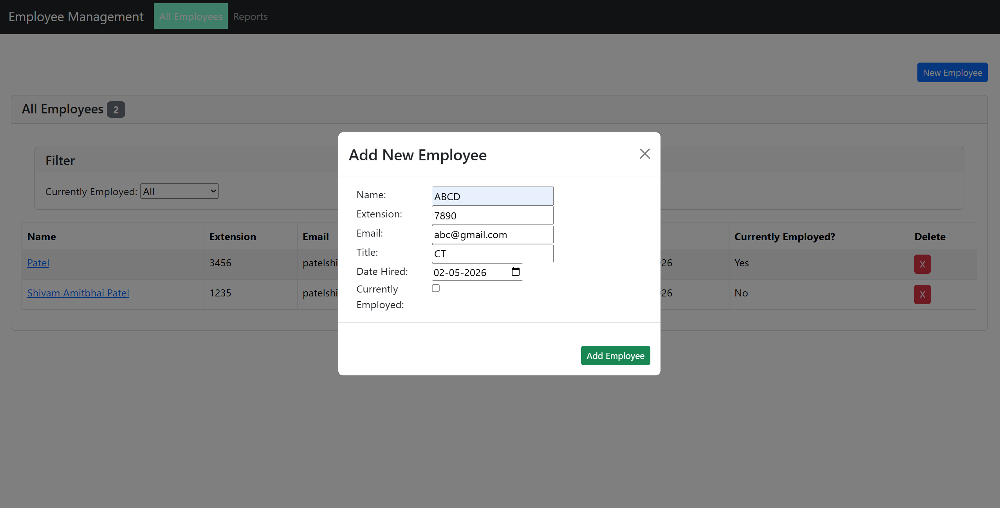
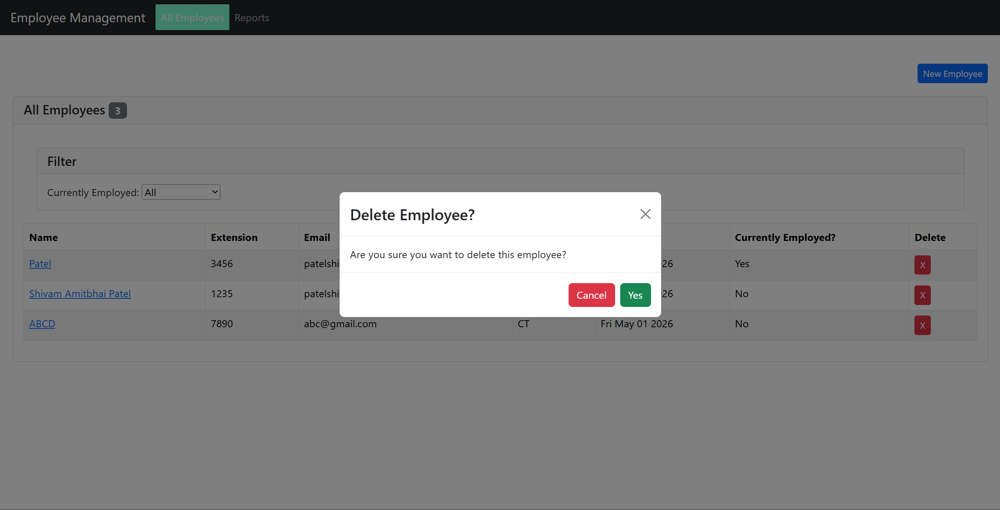
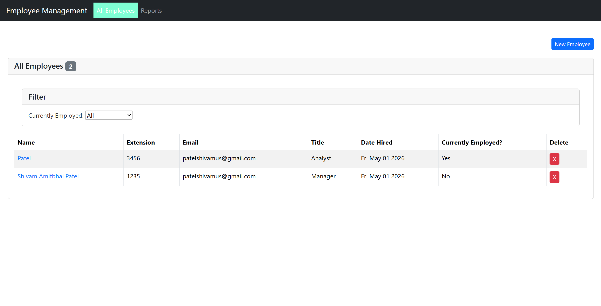

# Employee Management Application

A full-stack Employee Management Application built using:

- React (Frontend)
- Webpack (Bundling)
- Express.js (Backend)
- MongoDB + Mongoose (Database)

---

## 📁 Project Structure

project-root/
│
├── controllers/
├── models/
├── routes/
├── src/
├── public/
├── app.js
├── index.html
├── webpack.config.cjs
├── package.json
├── .env
└── README.md

---

## ⚙️ Installation

npm install

---

## 🔐 Environment Setup

Create `.env` file:

MONGO_URI=your_mongodb_connection_string  
PORT=5000

---

## 🛠 Build

npm run build

---

## ▶️ Run

npm start

Open:
http://localhost:5000

---

## 🌐 API

GET /api/employees  
POST /api/employees  
PATCH /api/employees/:id  
DELETE /api/employees/:id  

---

## 📸 Screenshots

### ➕ Add Employee

### ❌ Click Delete Button

### ✅ Confirm Delete (After Clicking Yes)

---

## 📂 Screenshots Folder

Create:
themes/

Add images:
add-employee.png  
delete-click.png  
delete-confirm.png  

---

## ✨ Features

- Load employees from MongoDB
- Add employee via modal form
- Delete employee with confirmation modal
- Update employee
- Filter employees
- React Router navigation
- Bootstrap UI (Cards, Tables, Modals)
- Modular React components
- Webpack bundling

---

## 📦 Commands

npm install  
npm run build  
npm start  

---

## ⚠️ Notes

.gitignore should include:

node_modules/  
.env  
public/*.bundle.js  

---

## 👨‍💻 Author

Shivam Patel